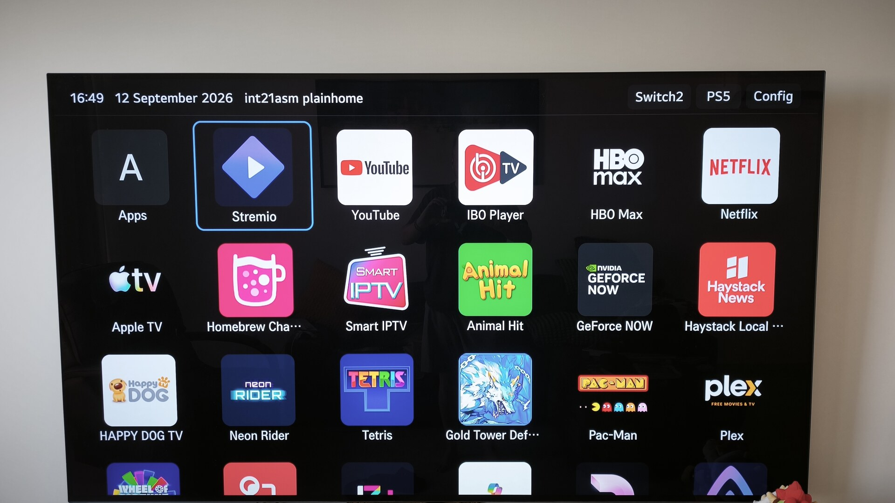

# PlainHome

A deliberately minimal launcher for LG webOS TVs:

- black background
- dynamically lists launchable installed apps
- large icons in a compact six-column grid
- persistent custom app order with new apps appended automatically
- Custom, LG-order, and alphabetical sorting, with a reset-to-LG-order action
- persistent hide/unhide controls for installed apps
- guarded removal of apps that webOS explicitly marks removable
- scrollable top bar with a clock, date, custom text, connected named HDMI inputs, and a Config menu
- independently configurable time and date formats, with an option to hide either one
- persistent focus-border and tile-background color selection; tile backgrounds default to OLED black
- optional launch at TV startup and optional Home-button takeover
- D-pad, Enter, Back, Magic Remote pointer and wheel scrolling



## Requirements

PlainHome currently requires a **rooted webOS TV with Homebrew Channel installed and its root service enabled**. Installing the IPK through LG Developer Mode on an unrooted TV is not sufficient: application discovery, icon access, connected-input detection, and app removal depend on rooted Homebrew services.

Unrooted TVs are not supported by the current release.

## Tested on

PlainHome has been developed and tested on:

- TV: LG OLED B3 (`OLED77B36LA`)
- webOS core release: `10.3.1-3001`
- Firmware: `33.31.61`

Other rooted LG webOS models and releases may work, but have not yet been verified.

## Build

Run:

```sh
./build.sh
```

The IPK and Homebrew manifest are written to `dist/`.

## Install and test

Install the IPK using webOS Dev Manager, then launch **PlainHome** from the normal launcher or Homebrew Channel.

Alternatively, run `./deploy-tv.sh`. It prompts for the TV address, SSH password and version, uploads and installs that IPK, then keeps only the two highest PlainHome IPK versions in the TV's `/tmp`. Values may also be supplied through `TV_HOST`, `TV_USER`, and `TV_PASSWORD` environment variables.

The app first requests the catalog directly. On firmware that blocks the request, it uses the rooted Homebrew Channel's documented `/exec` helper once to register the narrow Luna permissions required by this app. It creates `com.github.int21asm.plainhome.app.json` in the TV's existing Luna client-permissions directories, rescans Luna manifests, and restarts only PlainHome. It does not modify system application files.

Because webOS blocks one app from reading another app's icon, the Homebrew helper also runs the bundled `icon-copy.js`. That helper accepts only icon files contained in known webOS application roots, limits files to 2 MB, and copies them into PlainHome's own `icons/` directory. No system-owned file is changed.

The startup and Home-button features are disabled until enabled in Config. Enabling either feature creates `/var/lib/webosbrew/plainhome.conf` and a symlink in `/var/lib/webosbrew/init.d/` to PlainHome's packaged startup script. Startup detection subscribes to the TV power state. Home-button takeover reads Linux input events without grabbing or blocking the input device, then asks webOS to launch PlainHome after a Home press. Disable both options to remove the hook and configuration file.

## Controls

- Arrow keys: move
- Enter / remote wheel click: launch
- Hold Enter / OK: enter move mode; arrows reposition, OK saves, Back cancels
- Red button: refresh the installed-app list
- Yellow button: remove the selected app when webOS marks it removable (confirmation required)
- Back: close PlainHome
- Magic Remote pointer: point and click

The Config menu provides:

- time format: 24 hours, AM/PM, or Off
- date format: Day Month Year, Month Day, Year, DD/MM/YYYY, MM/DD/YYYY, or Off
- Custom, LG-order, and alphabetical sort modes
- custom-order reset
- focus-border color
- tile-background color, defaulting to OLED black
- optional custom header text, empty by default
- app hide/unhide controls
- optional launch at TV startup
- optional Home-button takeover

## Development disclosure

OpenAI Codex assisted with development. The maintainer is responsible for reviewing, testing, and publishing the code.
